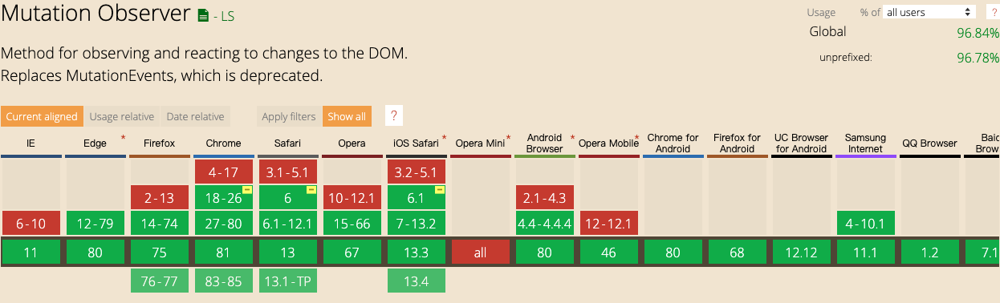

### 水印生成解决方案
### 前言
    做客户管理系统时，可以有一需求怕截图内容外泄，处于安全考虑需要给系统加上水印，以给用户部分警示
    
### 需求
- 能方便的自定义内容
- 检测水印节点变化

### 解决方案
- 1.通过查阅资料了解到目前大部分使用的方案是通过canvas生成水印，即获取到想要的内容，通过canvas生成base64图片在网站最上层覆盖一层
- 2.通过svg生成水印，兼容性更好
- 3.通过NodeJs生成水印
- 4.使用 `MutationObserver` 监听DOM变化及时作出反应

#### MutationObserver
通过canIUse 我们可以发现不部分的浏览器都兼容 `MutationObserver`，如需兼容更早的IE版本可以了解下 `Mutation Events` 此处不作展开



- disconnect()
    - 阻止 `MutationObserver` 实例继续接收通知，直到再次调用 `observe()` 时，该观察者对象包含的回调函数都不会再被调用
- observe()
    - 通知实例接收通知
- takeRecords()
    - 从 `MutationObserver` 的通知队列中删除所有待处理的通知，并返回它们到 `MutationRecord` 对象的新数组中
    
#### 一个DOM指定所要观察的特定变动有以下几种
| 属性 | 描述 |
|----|----|
|childList|需要观察目标子节点，则设置为true|
|attributes|如果需要观察目标节点的属性节点，也要观察该节点的文本内容变化则设置为true|
|characterData||
|subtree|是否需要观察目标节点的后代节点|
|attributeOldValue|在attributes设置为true的前提下，将发生变化的属性节点之前的属性值记录下来|
|characterDataOldValue|characterData设置为true的前提下|
|attributeFilter|一个属性名数组，只有该数组中包含的属性名发生变化时才会被观察|

### 通过canvas生成水印
```js
function _canvasWaterMark ({
    content = 'Watermark', rotate = 30,
    zIndex = 1000, parentNode = document.body,
    width = 200, height = 200, textAlign = 'center', textBaseline = 'middle',
    font = '20px Microsoft YaHei', fillStyle = 'rgba(184, 184, 184, 0.5)'
} = {}) {
    let args = arguments[0]
    let canvas = document.createElement('canvas')
    canvas.setAttribute('width', width + 'px')
    canvas.setAttribute('height', height + 'px')

    let ctx = canvas.getContext('2d')
    ctx.textAlign = textAlign
    ctx.textBaseline = textBaseline
    ctx.font = font
    ctx.fillStyle = fillStyle
    ctx.translate(width, height);
    ctx.rotate(Math.PI / 180 * rotate)
    ctx.translate(-width, -height)
    ctx.fillText(content, width / 2, height / 2)


    let base64Url = canvas.toDataURL()
    const __wm = document.querySelector('.__wm')
    const waterMaskLayer = document.createElement('div')
    let styleStr = `position: absolute;top:0;left:0;width:100%;height:100%;z-index:${zIndex};pointer-events:none;background-repeat:repeat;background-image:url('${base64Url}')`

    waterMaskLayer.setAttribute('style', styleStr)
    waterMaskLayer.classList.add('__wm')

    if (!__wm) {
        parentNode.style.position = 'relative'
        parentNode.insertBefore(waterMaskLayer, parentNode.firstChild)
    }

    const MutationObserver = window.MutationObserver || window.WebKitMutationObserver
    if (MutationObserver) {
        let mo = new MutationObserver(() => {
            const __wm = document.querySelector('.__wm')

            // 只有在 __wm 元素变动后才重新调用生成
            if ((__wm && __wm.getAttribute('style') !== styleStr || !__wm)) {
                // 避免重复调用
                mo.disconnect()
                mo = null
                _canvasWaterMark(JSON.parse(JSON.stringify(args)))
            }
        })

        mo.observe(parentNode, {attributes: true, subtree: true, childList: true})
    }
}
```

参考 腾讯前端水印生成方案[https://musicfe.cn/page/15]

