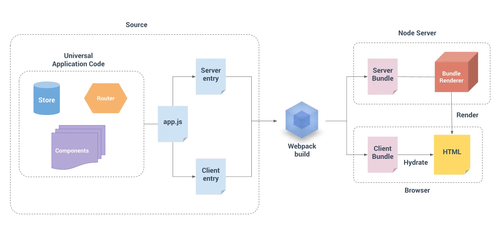

## 是什么
默认情况下可以在浏览器中输出vue组件，进行生成DOM与操作DOM，也可以将同一组件渲染为服务器端的HTML字符串，将他们直接发送到浏览器，最后将其激活为客户端上可交互的程序

## 传统的vue纯浏览器渲染
- 不利于seo  爬虫不抓取js抓取html（抓取工具不会等异步完成后抓取页面内容）
- 首屏过慢
- 浏览器负担过重
- 内存占用大

## SSR需要注意的点
- 开发条件限制，一些外部拓展库需要特殊处理，才能在服务器渲染中运行
- 设计构建设置与部署的要求更多，需要node环境
- 服务端压力更大（需要负载均衡与缓存）

## 预渲染
若SSR只是用于改善少部分页面，那么就可以使用预渲染，无需web服务器实时动态编译html，在构建时简单生成针对特定路由的的静态html文件
- prerender-spa-plugin

## SSR
- 将js等在node上跑将node端执行的html给到浏览器

- 组成
    - 服务端打包入口 =》 生成服务端代码
    - 客户端打包入口 =》 生成客户端代码
    
- 特性
    - 每次都会创建一个vue实例
    - ssr 核心库 vue-server-render
    - 只会触发 beforeCreated与created钩子
    
    
