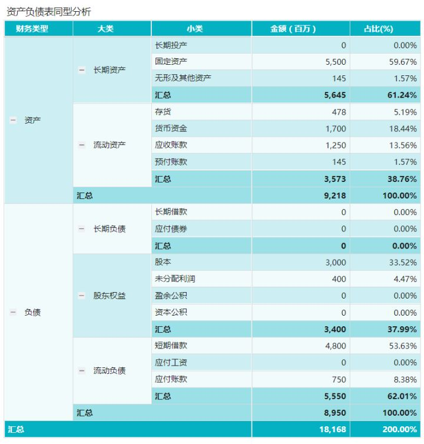

## 基础
### 价格
- 开盘价：以竞价阶段第一笔交易价格为开盘价，若没成交则以前一日收盘价为开盘价
- 收盘价：每天成交中，最后一笔股票价格
- 最高价：当日所成交价格的最高价位
- 最低价：当日成交价格中的最低价位

### 涨跌幅限制
- 一个交易日内，除上市首日的证券外，证券的交易价格相对上一交易日收市价格的涨跌幅不得超过10%；超过涨跌价格的委托为无效委托
- 多头、多头市场：多头是指投资者对股市看好，预计股价会看涨，于是趁低价时买进，待股票上涨到某一价位再卖出，以获取差额收益，通常把长期保持上涨势头的股票市场称为多头市场，特征为一连串的大涨小跌
- 空头、空头市场：投资者与股票商认为现在股票价格虽然较高，但对股票前景看坏，预计股票会下跌将股票及时卖出，等跌到某一价位再买入，特征为大跌小涨
- 洗盘：投机者先把股价大幅杀低，让散户产生恐慌，抛售股票，然后再把股票抬高，以便乘机渔利
- 回档：在股市上，股价呈不断上涨趋势，终因股价上涨速度过快反转会跌到某一价位，这一调整现象称为回档。一般而言，股票回档 幅度比上涨幅度小，通常是反转会跌到前一次上涨幅度的三分之一左右时又恢复原来的上涨趋势。
- 反弹：在股市上，股价呈不断下跌趋势，终因股价下跌速度过快而反转回升到某一价位的调整现象称为反弹，通常反弹到前一次下跌幅度的三分之一的时候，恢复原来下跌趋势
- 买空：投资者预测股价会上涨，但自有资金有限不能购进大量股票于是先缴纳部分保证金，并通过经纪人向银行融资以买进股票，待股票上涨到某一价位时再卖。
- 卖空：投资者预测股票价格会下跌，于是向经纪人交付抵押金，并借入股票抢先卖出。待股价下跌到某一价位再买进股票然后归还借入股票，从中获取收益
- 多杀多：多头杀多头，投资者普遍认为当天股价会上涨于是大家抢多头帽子买进股票，然而事与愿违，股价没有大幅上涨，无法高价卖出股票，等到股市结束，竞相卖出造成股市收盘价格大幅下跌。
- 轧空：空头倾轧空头，大多数人认为股票会下跌。于是多数人去抢卖空头帽子卖出股票。然而，当天股票并没有大幅下跌，无法低价买入。股市结束前，做空的只好竞相补进，从而出现收盘价大幅度上升。
- 跳空：受强烈利多或利空消息刺激，股价开始大幅跳动。跳空通常在股价大变动的开始或结束前出现
- 补空：空头买回以前卖出股票的行为。
- 套牢：进行股票交易时遭遇的交易风险。如预计股价上涨，但是在股票买入后却呈下跌趋势，相反预计股价下跌，将股票放空卖出，但股价却一直涨，这种称为空头套牢
- 阻力线：股市受利多信息影响，股价跌至某一价位时，做多头的认为有利可图，但实际却有大量卖出，使股价停止上升甚至会跌，股市上一般称这种关卡为阻力线
- 支撑线：股市受利空信息影响，跌至某一价位时，做空多头的认为有利可图，大量买进股票，使股价不在下跌，甚至出现回升趋势。
- IPO：首次公开发行股票
- 涨停板：涨跌幅度不超过10%
    - 股价上涨10%后超出涨跌幅的交易价格为无效委托，股票涨停后不会继续上涨，但是有可能下跌
    
### 财报分析
#### 目的
- 分析公司业务存在的现实问题
- 提出切实可行的解决方案

#### 基础财务报表
##### 资产负债表
- 资产负债表主要包含企业经营在每个会计期初和期末期间总的资产现金（企业还有多少现金，至少还能换取多少现金）、总体负债情况（企业目前欠了多少债务）以及股东等企业所有者的权益（股东投资金额以及累计盈亏情况），通常用于反映企业资产结构、偿债能力、管理水平、利益归属等情况，类似于某个时间点用照相机给企业拍摄的一张企业经营总览照片

##### 利润表
- 利润表主要包含企业经营在一段时期内的效益能力，如企业营业收入、营业成本、净利润等信息，通常用于反映企业的盈利能力和产品竞争力，类似于某段时间内用摄影机给企业拍摄的一段盈利能力视频。

##### 现金流量表
- 现金流量表主要包含企业经营在一段时间内生产经营、投资以及筹资活动中产生的现金流情况，通常用于反映企业的利润水平和企业健康情况，类似于某段时间内用摄影机给企业拍摄的一段现金流量周转视频。

#### 分析方法
##### 同型分析
- 首先来看看我们财务数据分析最常用的同型分析法，所谓同型分析其实本质上是一种结构分析方法。例如对于资产负债表，我们通常可以通过同型分析详细列明企业各项资金占据总资产的比重，分析企业的资产负债组成结构。另外对于财务数据中的利润表，我们同样也可以通过同型分析法观察各个项目在利润表中的结构占比，以及收入到利润的过程中每一个步骤所产生的损耗等。
  

- 对资产负债表做数据同型分析，自动计算出每一项资产在总资产中的占比。从上图可以快速看出，企业的固定资产为59.67%，无形资产为1.57%，流动资产中存货、货币资金、应收账款、预付账款分别为5.19%、18.44%、13.56%、1.57%，也就是企业流动资产仅占据企业资产的38.76%，固定资产接近60%。
  
- 另外再来单独看这家企业流动资产中的应收账款，占据了企业总资产的13.56%，这比例对于总资产来说是一个不小的数值，说明这家企业的产品没那么好卖，可能正面临着较大的市场竞争，因为很多制造型企业往往和采购方签约有可能采取延后收款时间来获得更大的市场竞争能力。

- 最后看下这家企业的负债情况，企业总负债占据了62.01%，其中短期借款占比最大，占据了53.63%，其次是应付账款，为8.38%。股东权益方面总共占据了37.99%，其中最初企业股东共同投资的原始股本占据比例为33.52%，未分配利润占比为4.47%，盈余公积和资本公积都是0，总体来看企业经营效益并不是很好。

##### 趋势分析
- 第二种财务数据常用的分析方法为趋势分析法，通常指的是将实际达到的结果与不同时期的财务数据中同类历史指标数据进行比较，从而确定财务经营状况、经营成果和现金流量的变化趋势以及变换规律的一种分析方法。通常对于企业的资产负债表、利润表、现金流量表来说，现金流量表经常需要通过趋势分析的方法来观察某一段时间内企业现金流量变化的走势。
  
##### 比较分析
- 最后给大家介绍的一种常用的财务数据分析方法为比较分析法，通常指的是通过两个或者两个以上相关指标进行对比，确定指标之间的差异，并进行差异分析或者趋势分析的一种数据分析方法。比较分析方法通常可以划分为三大类：

- 第一类是企业内部指标数据进行对比分析，例如企业各个地区的销售额可以进行数据比较分析，找出销售业绩相对较好的地区总结相关经验给销售业绩相对较差的地区进行优化整改。例如上图中我们可以通过热力地图快速感受到企业在北京、上海地区销售体量的重要性，但是同类地区例如广东的广州和深圳却并不突出，这个是企业决策层所急切需要关注的问题。

- 第二类是对于企业同一指标可以根据不同的时间形成多个指标进行对比分析，例如企业的销售额可以进行同比环比分析，结合预警小图标，快速观察出和去年或者上个月的销售业绩是否提升或者下降，找出对应时间可能存在的企业经营问题 

- 第三类情况下，除了和企业自身的经营数据做对比之外，我们还可以将自身企业的数据和同行业的同等或者优秀企业的调研参考数据进行经营数据对比分析，以清楚目前自己企业在市场上所处于的级别层次，选择和借鉴更加适合自己的企业经营方略。

### 说明
#### 市盈（TTM）
- 市价盈利比例
- 计算 股票价格/每股收益
- 用于判断股票是否被高估或低估
- < 0 公司盈利为负
- 0-13 公司被低估
- 14-20 正常水平
- 21-28 被高估
- 28+ 投机性泡沫

#### ROE（TTM）

#### 营收增速

#### 净利增速

#### 君正

市盈 18.85

